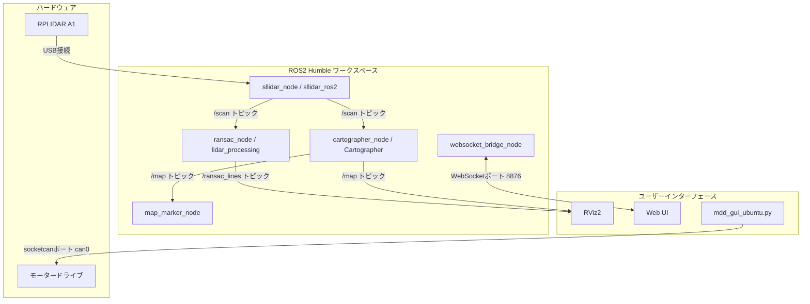

# RPLIDAR A1 と Cartographer を用いた 2D SLAM およびモーター制御システム

このリポジトリは、ROS2 Humbleの環境においてRPLIDAR A1のスキャンデータを用いて2Dの自己位置推定および地図生成を行うパッケージ群と、モータードライブを制御するツールの構成です。
自己位置推定のアルゴリズムにはCartographerを採用しており、車輪のエンコーダー情報などのオドメトリ情報を用いずに地図の作成が可能です。
レーザースキャンデータから壁などの直線情報を抽出する機能や、モータードライブをCAN通信で制御するGUIツールも含みます。

## システムの構成図

リポジトリ内の各要素とハードウェアの接続関係は以下の通りです。



## ディレクトリとファイルの構成

* ros2_ws: ROS2 Humble向けのワークスペースです
  * src/altair_robot: ロボット全体の起動やWebブラウザ向けのインターフェースを提供します
  * src/lidar_processing: レーザースキャンから直線情報を抽出するノードを含みます
  * src/sllidar_ros2: RPLIDARのROS2用ドライバーです
* run_slam.sh: SLAMのシステムと可視化用のノードを一括で起動するシェルスクリプトです
* mdd_gui_ubuntu.py: モータードライブをCAN通信経由で制御および監視するGUIアプリケーションです

## 環境構築の手順

必要なパッケージのインストールとビルドを行います。

* 依存パッケージのインストール
  ```bash
  sudo apt update
  sudo apt install ros-humble-cartographer-ros
  pip3 install scikit-learn numpy scipy python-can
  ```

* ワークスペースのビルド
  ```bash
  cd ros2_ws
  rosdep update
  rosdep install --from-paths src -y --ignore-src
  colcon build --symlink-install
  source install/setup.bash
  ```

* シリアルポートの権限設定
  RPLIDARを接続するシリアルポートに対して読み書きの権限を付与します。
  ```bash
  sudo chmod 666 /dev/ttyUSB0
  ```

## 使用方法

* SLAMシステムの起動
  一括起動スクリプトを実行することで、LiDARの通信やCartographer、直線抽出ノード、RViz2が立ち上がります。
  ```bash
  ./run_slam.sh --serial /dev/ttyUSB0
  ```
  詳細なオプションはヘルプコマンドで確認できます。
  ```bash
  ./run_slam.sh --help
  ```

* モーター制御ツールの起動
  CAN接続を介してモーターのパラメータ設定や目標値の送信を行うためのGUIを起動します。
  ```bash
  python3 mdd_gui_ubuntu.py
  ```

## ライセンス

このプロジェクトはMITライセンスのもとで公開されています。詳細はLICENSEファイルを参照してください。
