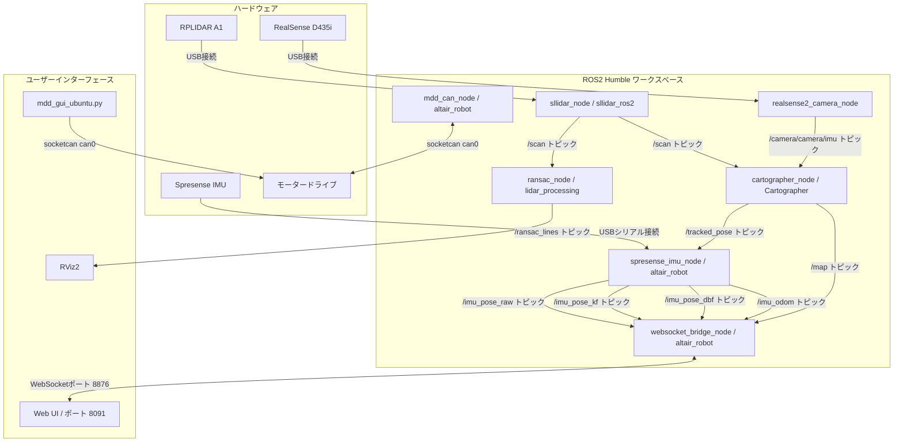

# RPLIDAR A1 と Spresense IMU を用いた 2D SLAM および自己位置推定融合システム

このリポジトリは、ROS2 Humbleの環境においてRPLIDAR A1のスキャンデータを用いた2Dの自己位置推定および地図生成を行うパッケージ群と、Spresense IMUやRealSense D435iの慣性計測ユニットを用いた高頻度な自己位置推定および融合システムです。
また、モータードライブを制御するツールや、自己位置推定結果の比較を行うためのウェブインターフェースも含みます。

## 主な機能

* Cartographerを用いた自己位置推定および地図生成
  RPLIDAR A1のスキャンデータを用いて地図の作成が可能です。
* 複数の自己位置推定の計算と融合
  Spresense IMUモジュールから取得した加速度と角速度の情報を用いて、生積分による軌跡、カルマンフィルターを適用した軌跡、遅延バイアスフィードバックを適用した軌跡の3種類を算出します。
  Cartographerによる地図生成の結果を観測値として取り込み、カルマンフィルターや遅延バイアスフィードバックを用いてIMUのドリフト誤差を動的に補正および融合します。
* 実験用ウェブインターフェース
  WebSocket通信を経由して、各自己位置推定の手法（生積分、カルマンフィルター、遅延バイアスフィードバック、SLAM単体）による軌跡をリアルタイムでブラウザ上に描画し、比較実験を行うことができます。
* 壁面直線抽出
  レーザースキャンデータから直線情報を抽出して配信します。
* モータードライブ制御
  モータードライブをCAN通信経由で制御および監視するためのGUIツールとROS2ノードを含みます。

## システムの構成図

リポジトリ内の各要素とハードウェアの接続関係は以下の通りです。



## ディレクトリとファイルの構成

* ros2_ws: ROS2 Humble向けのワークスペースです
  * src/altair_robot: ロボット全体の起動設定、Spresense IMUを用いた位置推定および融合処理のノード、Webブラウザ向けインターフェース、モーター制御用のCANノードを含みます
  * src/lidar_processing: レーザースキャンから直線情報を抽出するノードを含みます
  * src/sllidar_ros2: RPLIDAR of ROS2用ドライバーです
* run_slam.sh: SLAMのシステムとIMUの処理、可視化用のノードを一括で起動するシェルスクリプトです
* mdd_gui_ubuntu.py: モータードライブをCAN通信経由で制御および監視するGUIアプリケーションです

## 環境構築の手順

必要なパッケージのインストールとビルドを行います。

* 依存パッケージのインストール
  ```bash
  sudo apt update
  sudo apt install ros-humble-cartographer-ros
  pip3 install scikit-learn numpy scipy python-can pyserial
  ```

* ワークスペースのビルド
  ```bash
  cd ros2_ws
  rosdep update
  rosdep install --from-paths src -y --ignore-src
  colcon build --symlink-install
  source install/setup.bash
  ```

* ポートの権限設定
  RPLIDARやSpresenseを接続するUSBポートに対して読み書きの権限を付与します。
  ```bash
  sudo chmod 666 /dev/ttyUSB0
  sudo chmod 666 /dev/ttyUSB1
  ```

## 使用方法

* SLAMシステムおよびIMUノードの起動
  一括起動スクリプトを実行することで、各種センサーの通信、Cartographer、直線抽出ノード、Spresense IMU融合ノード、Webソケットブリッジ、Webサーバー、RViz2が立ち上がります。
  ```bash
  ./run_slam.sh --serial /dev/ttyUSB0 --spresense-port /dev/ttyUSB1
  ```
  RealSense D435iのIMUを利用する場合は、起動時のオプションを変更します。
  ```bash
  ./run_slam.sh --enable-realsense-imu
  ```
  詳細な起動オプションはヘルプコマンドで確認できます。
  ```bash
  ./run_slam.sh --help
  ```

* モーター制御ツールの起動
  CAN接続を介してモーターのパラメータ設定や目標値の送信を行うためのGUIを起動します。
  ```bash
  python3 mdd_gui_ubuntu.py
  ```

## ライセンス

このプロジェクトはMITライセンスのもとで公開されています。詳細はLICENSEファイルを参照してください。
